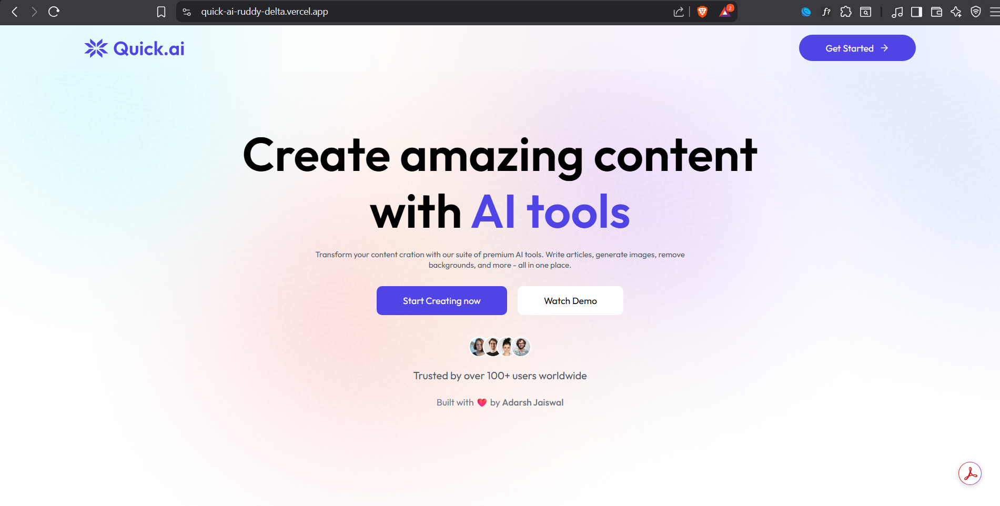

# ⚡ Quick AI — All-in-One AI Tools Platform


A **modern AI-powered web platform** that provides multiple intelligent tools for **content creation, image generation, image editing, and resume analysis** — all in one clean and user-friendly interface.

---

## 📌 Table of Contents
- [Demo](#-demo)
- [Features](#-features)
- [Tech Stack](#-tech-stack)
- [How to Run](#-how-to-run-locally)
- [About Project](#-about-project)
- [What I Learned](#-what-i-learned)
- [About Me](#-about-me)
- [Connect with Me](#-connect-with-me)

---

## 🚀 Demo

🔗 **Live Demo:** https://quick-ai-ruddy-delta.vercel.app/

---

## ✨ Features

### 📝 AI Content Tools
- **AI Article Writer**  
  Generate high-quality, engaging articles on any topic using AI.

- **Blog Title Generator**  
  Create catchy and creative blog titles instantly.

---

### 🎨 AI Image Tools
- **AI Image Generation**  
  Generate stunning visuals using AI-powered image generation.

- **Background Removal**  
  Automatically remove image backgrounds with high accuracy.

- **Object Removal**  
  Seamlessly remove unwanted objects from images using AI.

---

### 📄 Career Tool
- **Resume Reviewer**  
  Analyze resumes using AI and receive suggestions to improve job readiness.

---

## 🛠️ Tech Stack

- ⚛️ **React.js** — Component-based frontend  
- ⚡ **Vite** — Fast development & build tool  
- 🎨 **CSS / Tailwind CSS** — Responsive UI design  
- 🤖 **AI APIs** — Text & image processing  
- ☁️ **Vercel** — Deployment & hosting  

---

## 🚦 How to Run Locally

```bash
# Clone the repository
git clone https://github.com/adarshj61/quick-ai.git

# Move into the project folder
cd quick-ai

# Install dependencies
npm install

# Start development server
npm run dev

```
---
## 📖 About Project

Quick AI was built as a real-world AI-based web application to combine multiple AI utilities into a single platform.  
The goal was to create a fast, scalable, and user-friendly experience while working with modern frontend tools and AI integrations.

This project was completed within **1 month**, focusing on real deployment, clean UI, and practical AI use cases.

---

## 📚 What I Learned

- Integrating multiple AI tools into one platform  
- Working with AI APIs for text and image processing  
- Building scalable and reusable React components  
- Improving UI/UX for real users  
- Deploying production-ready applications using Vercel  

---

## 👨‍💻 About Me

Hi, I’m **Adarsh Jaiswal**, a B.Tech CSE student passionate about **Web Development** and **AI-powered applications**.  
I enjoy building real-world projects and continuously improving my technical skills.

---

## 🤝 Connect with Me

<p align="left" style="display: flex; gap: 10px; flex-wrap: wrap;">
  <a href="https://www.linkedin.com/in/adarsh-jaiswal-78a266353" target="_blank">
    
  </a>

  <a href="https://github.com/adarshj61" target="_blank">
    
  </a>

  <a href="mailto:aj941545@gmail.com">
    
  </a>
</p>
